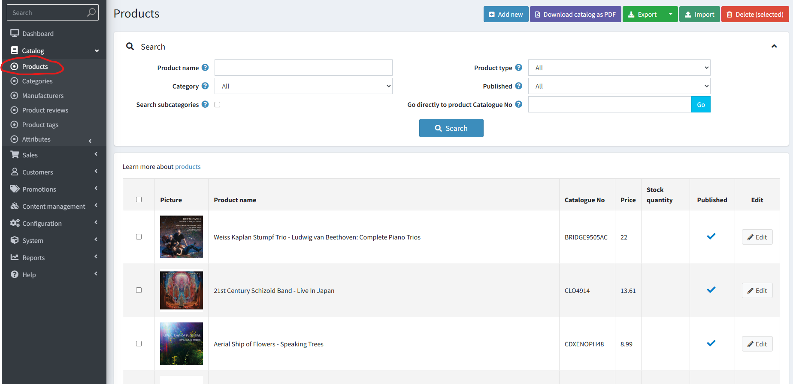
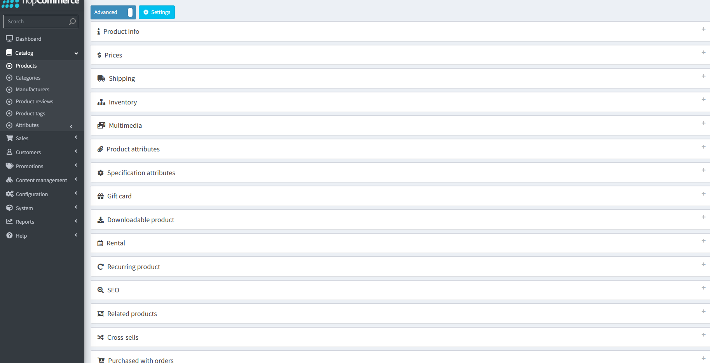
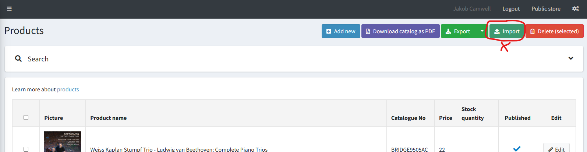

Retrieving and searching for any product in the Catalogue

The Catalogue section on the Admin side of B2B would mainly be used to change details of a product, a category or product specification attributes.
Our product importer should get all of the details correct, but if some information has been entered incorrectly and you want to edit a product without re-running the import feed, you can search for a product and edit it here.

:::info

If you click on one of the products that is in the catalogue it will open up multiple expandable sections (below) that list a products details and connections

:::

If there are categories or product specification attributes that you would like to add or change please get in contact with the VentureAxis team to discuss.

:::warning
Please Note: We **do not** use the standard `Import`, we have a dedicated product importer that directly import products from Basil to B2B that isn't managed from B2B

:::
