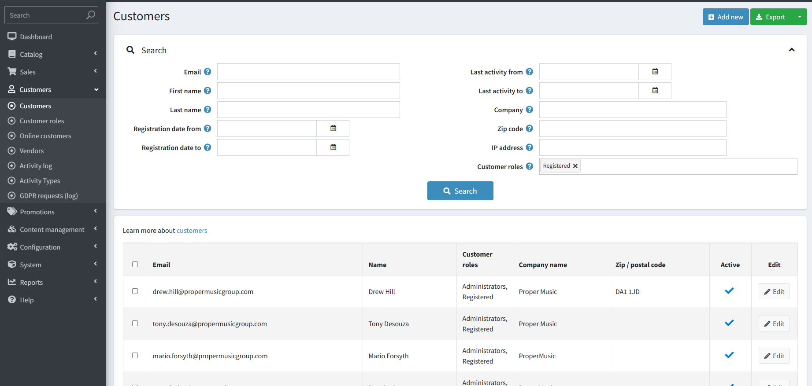
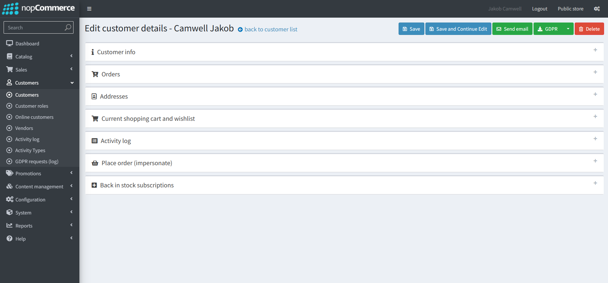
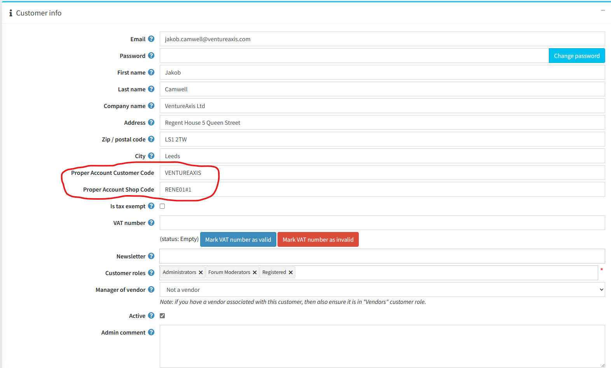

Adding new Customers, changing passwords, sending a direct email

The Admin Customers section allows you to view and edit all customers, shows a live online-customer count, and logs for all customer activities.
The main page we will need is the first Customers tab, where you can add or edit users.

:::info

:::

When editing a customer there will be a few expandable sections allowing you to edit or view different aspects of a customer.
:::info
The toolbar at the top allows you to Send an Email straight to the currently selected customer, export or delete GDPR data or delete the customer entirely.

:::

**Customer Info**

The Customer Info tab lets you change the basic details of a customer (name, email, password) and this tab also contains where the Proper Account Customer and Shop Code are set for each user to view their specific store.

:::warning
Both the Proper Account Customer Code **and** the Proper Account Shop Code need to be set for a customer to be able to use B2B.
:::

**Orders**

Within the Orders tab you can get a quick overview of the customers orders and where they are in the process, as well as clicking on any of these orders to get further information.

There is also another tab further down named `Place order (impersonate)` where you can order a product as if you were the customer you are viewing.
