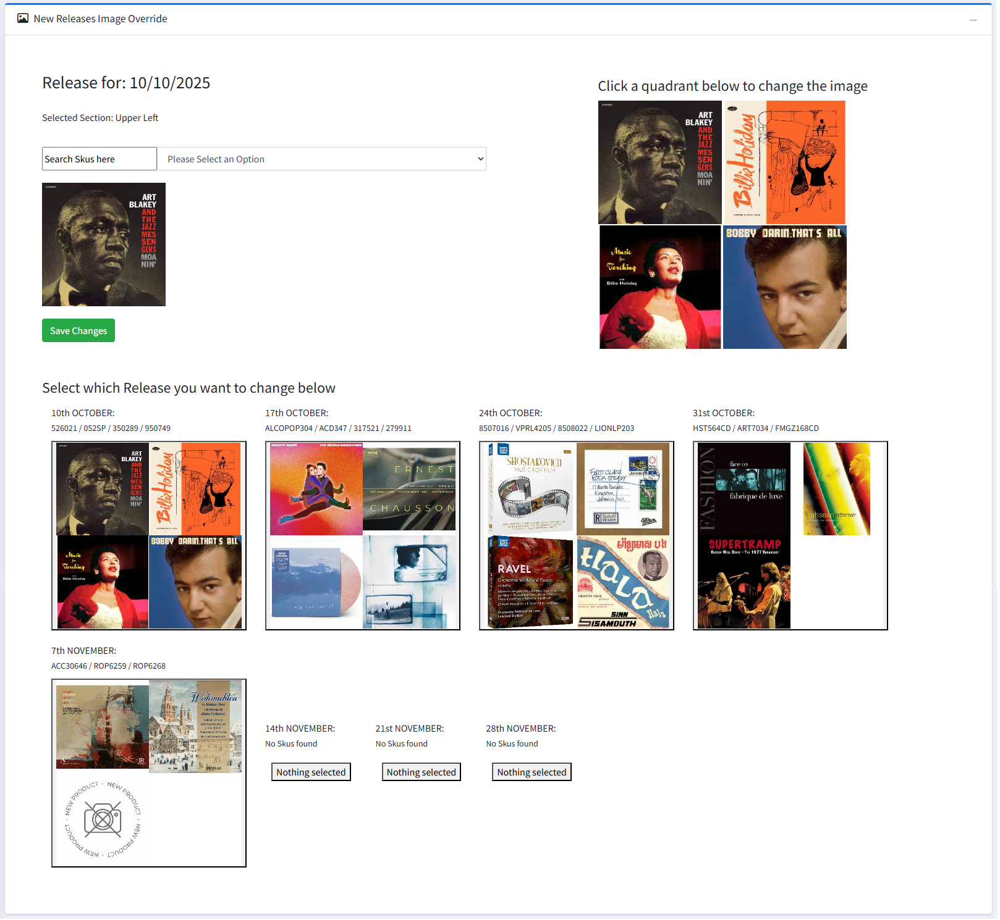

New Release Image Override

On the B2B admin dashboard the "Go To New Release Override" button will take you to a page that has a similar structure to the below picture.

It shows the the next 8 weeks of releases with a grid of 4 each populated with a certain product's album art from that release period.
Only the next 4 weeks will be shown on the homepage, but you can set all 8 weeks in this section so that you have a bit of a buffer.

Once a week is over, the next week is automatically created from available products so at least each week will have a product albums assigned to it.

By selecting a square from the list of weeks, you will load that release week and its product into the customisation section in the top section of the page.
In the customisation section you can select a quadrant to change its album art by searching and selecting for a product from the search bar - which also shows its album art upon selection.

:::info
If you see the "No Skus found" message for a certain week it means that the week did not have any valid products to select - contact the VentureAxis team to assign products to this release week.
:::

Here is a video example of changing a release weeks album square: