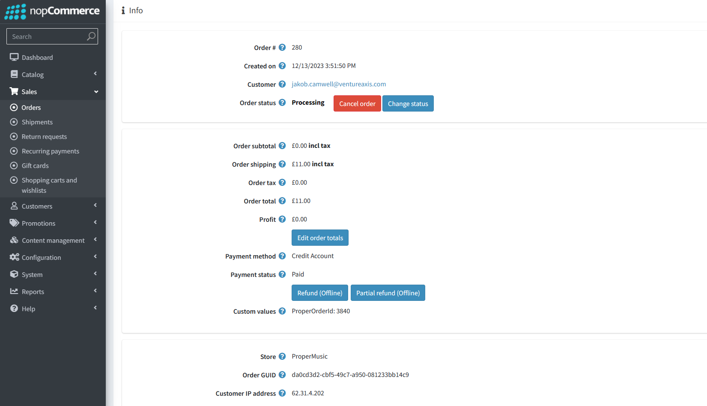
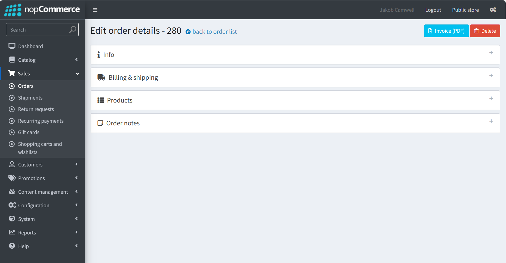
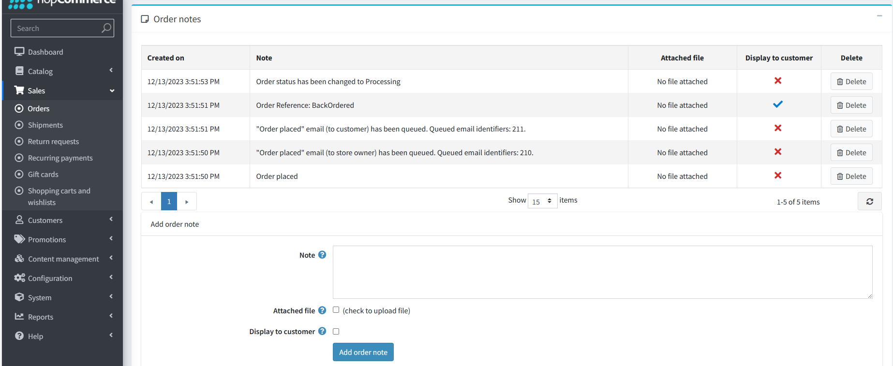

Viewing any Pending, Processing or Completed Orders

The Admin section to view site wide orders is under the Sales tab on the left of the admin site.
Under the Orders section you can search and sort all orders in a multitude of ways.

Each order can then be further viewed to see its details and you can edit the order to either change its status, cancel/refund the order and more.

The other tabs of each orders details allow you to see more of the specific details of the order

In the order notes tab, more notes (other than the automatically assigned ones) can be added to a the order, whether that note is also shown to the customer is upto you.

