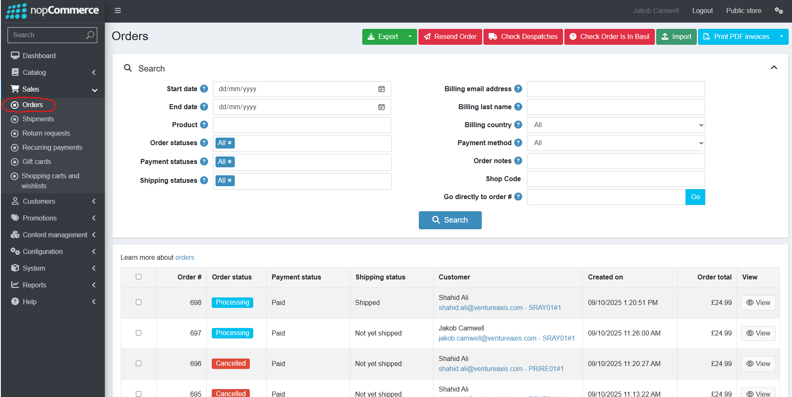
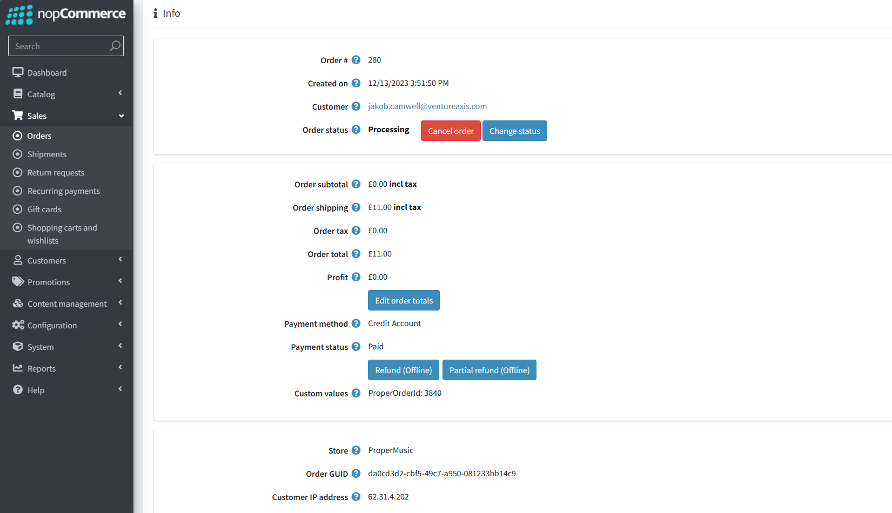
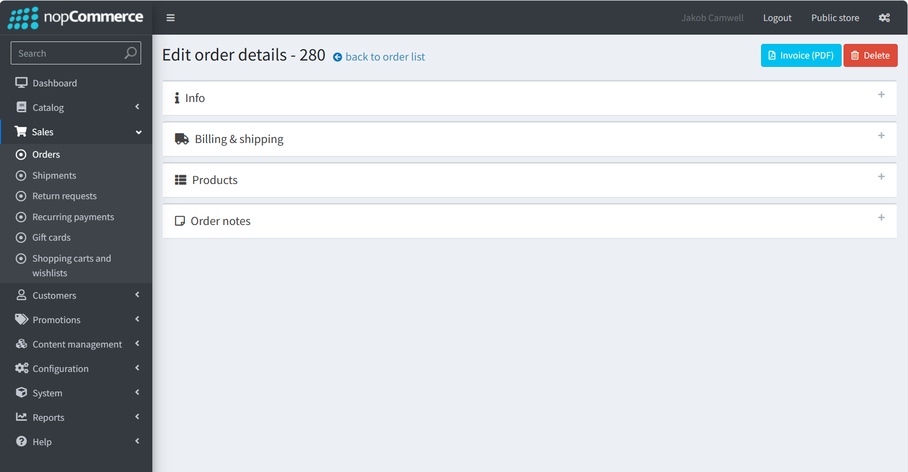
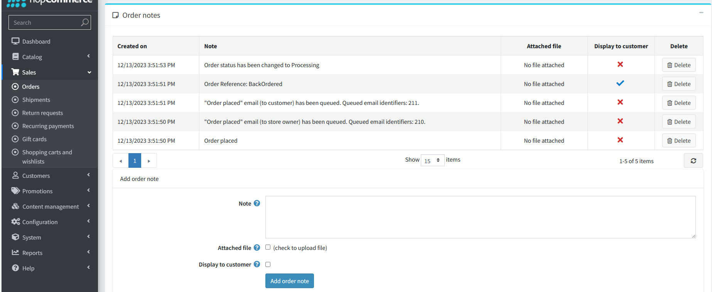

Viewing any Pending, Processing or Completed Orders

The Admin section to view site wide orders is under the Sales tab on the left of the admin site.
Under the Orders section you can search and sort all orders in a multitude of ways.

At the top of the page there are 3 buttons that you can refer to in the case that something goes wrong with an order.

- The "Resend Order" will **not** recreate the selected order in the B2B system or resend the order confirmation email, it will just resend the order information to Basil to be processed again if the order is not present in their system.
- The "Check Despatches" button will check Basil for despatch information to be attached to the selected order. This process should be done automatically every 30 minutes, but you can click this button if this process failed or you want to manually run the process.
- The "Check Order Is In Basil" button will simply attempt to retrieve the order from basil. This can be useful if you want to ensure the order is in Basil without trying to resend it (which could possibly create a duplicate order).

Each order can be further viewed to see its details and you can edit the order to either change its status, cancel/refund the order and more.

The other tabs of each orders details allow you to see more of the specific details of the order

In the order notes tab, more notes (other than the automatically assigned ones) can be added to a the order, whether that note is also shown to the customer is upto you.

