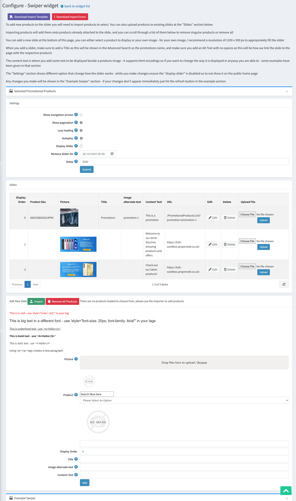
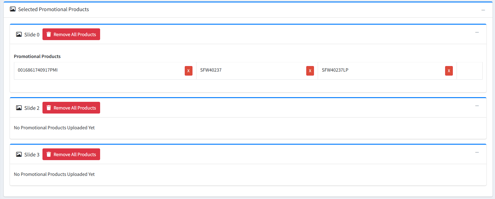
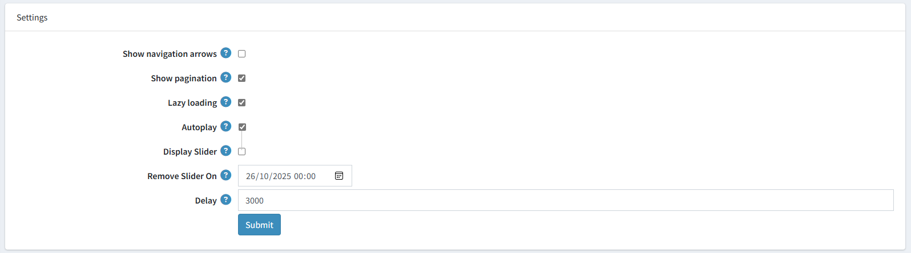
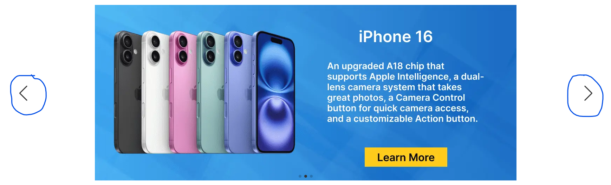
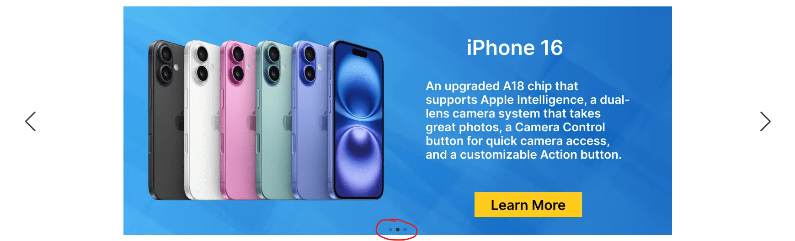
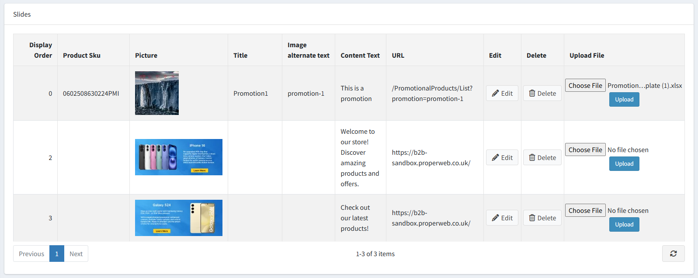
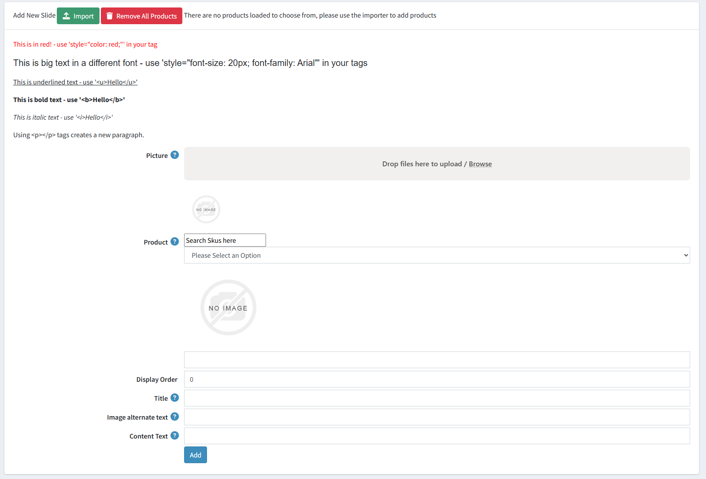
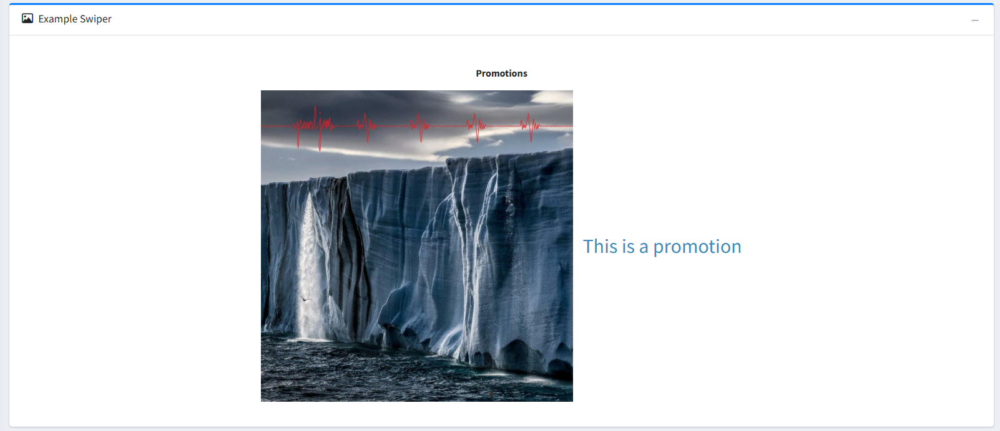

import ReactPlayer from 'react-player'
import AutoplayVideo from '../../static/video/vid-promotion-autoplay.mp4';

Product Promotions

On the B2B admin dashboard the "Go To Product Promotion Settings" button will take you to a page that has a similar structure to the below picture.

## **Selected Promotional Products**
The Selected Promotional Product section shows each slide currently set for the promotions slider, and the products attached to each slide.
When a user clicks on a certain slide, they will be redirected to the advanced search page with the promotion filter already set to show all products attached to that promotion.

From this section you can delete singular products from the slide, or all products.
This section is also collapsible in case you have hundreds/thousands of products attached to a promotion, which can take a while to load.

## **Settings**

The settings section shows the basic options to change some functionality of the promotions slider.

- Show navigation arrows: toggles the left/right arrows on the slider

- Show pagination dots: toggles the dots at the bottom of the slider to show which slide you are on

- Display Slider: toggles whether the slider is shown on the homepage or not
- Remove Slider On: set a date and time for when you want to remove the slider automatically from the homepage
- Autoplay: toggles whether the slider will automatically scroll through the slides

:::info
The autoplay speed can be set by the "delay setting" which is in milliseconds (1000ms = 1 second)
<ReactPlayer playing controls url={AutoplayVideo} />
:::

## **Slides**

The Slides section shows all the slides currently set for the promotions slider.
In this section you can upload new products for a certain slide, edit its content or tile, or delete the slide entirely.

## **Add New Slides**

The Add New Slide section allows you to create a new slide for the promotions slider.
To give the slide access to products for you to select an album of, you need to import an excel file with the products you want (The template for this can be downloaded at the top of the page).

If you want more customisation of the slide than what is offered in this section, you can create an image and upload it as the slide image (The best image size to fill the homepage space is 1200 x 500 pixels).

## **Example Swiper**
This section shows an example of what the promotions slider looks like on the homepage of B2B, without having to display on the public store.

## **Video Example**
This is a video example of the promotional products process from importing products, to displaying them on the homepage: