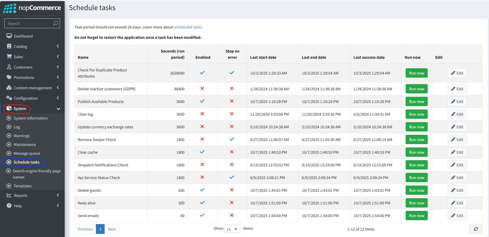

Scheduled Tasks

Under System -> Schedule Tasks, you can see a list of all the automated tasks that run in the background of B2B.

It shows which tasks are enabled, when they last ran, how often they run and the last date it was successful.

As these are all setup to run automatically, nothing should need to be changed here.

