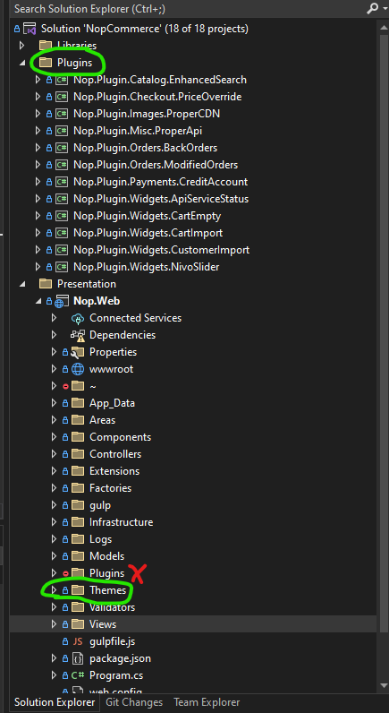

B2B - The Code Side

:::warning
Please Note: This Overview and The Source Code section is to help developers understand B2B's code, this will not cover anything on the active website side.
:::

NopCommerce is the opensource eCommerce platform that we use to host B2B, working with an ASP.NET Core framework and MS SQL Server database.
We use plugins to add our custom code and logic to tailor B2B to the specifications given by Utopia.
B2B is also connected to ProperMusics dedicated API, allowing us to retrieve discounts, orders, credit limits throughout the site.

If you have access to the VentureAxis Azure Devops system and have successfully cloned the ProperMusicB2B repository into Visual Studio, you should see a file system similar to this:

:::info
The main development points for the B2B system would be in the Themes folder and the Plugins folder (Not the Plugins folder contained within Nop.Web)

:::
Each plugin is designed to perform different tasks or alter the site in some way, other than the `Nop.Plugin.Misc.ProperApi` which contains general methods and functions used throughout most plugins.
The Themes folder contains a few individual website pages that were customised in some way and the CSS used to style the website.

For more detailed information on B2Bs source code, follow this link to the **[Source Code](/docs/category/the-source-code)**
