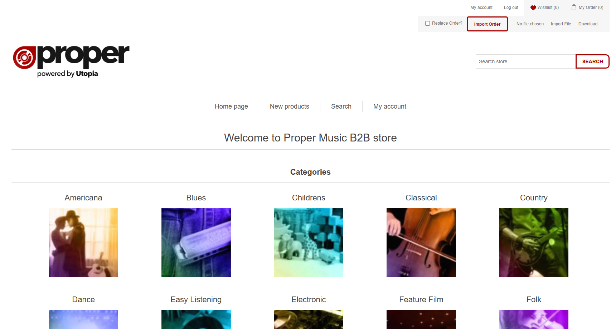

The B2B Solution

B2B is an integral application of the ProperMusic workflow and one application of three that most users interact with (ProperMusic.Web, OneSheets and B2B). It controls the configuration, sales, and handling of Products created through ProperWeb.

The application uses the open-source eCommerce software NopCommerce and is customised through multiple custom plugins.
 

Access to frequently used options is available from the toolbar, for example, the Customer list and Scheduling screens.
While this is functionally adequate, the UI is extremely dated and is not representative of how modern applications created by the Clarion Development language can look.

:::info
This image highlights the Order Import feature in red and the Advanced Search in blue.

In this image we can see the optional extras for the Order Import highlighted in orange.
The pink, green and yellow highlights indicate the toolbar options that can be hovered over to open extra features / navigation buttons

:::

My Account

An example of what your My Account page should look like to start using B2B straight away - if they are not filled out and you are unsure of how to set them please seek assistance from B2B's technical manager.

:::info
We can see here, highlighted in red, the options section of My Account.
Please ensure your Proper Account Customer/Shop Code are both filled out with the correct information.
(Customer Code should be VENTUREAXIS and Shop Code should be your stores custom code)

:::
