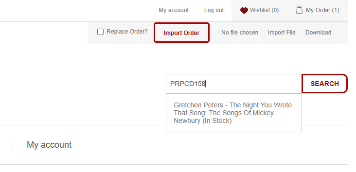
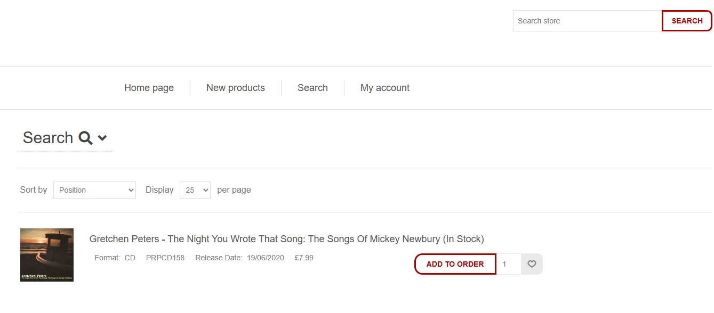
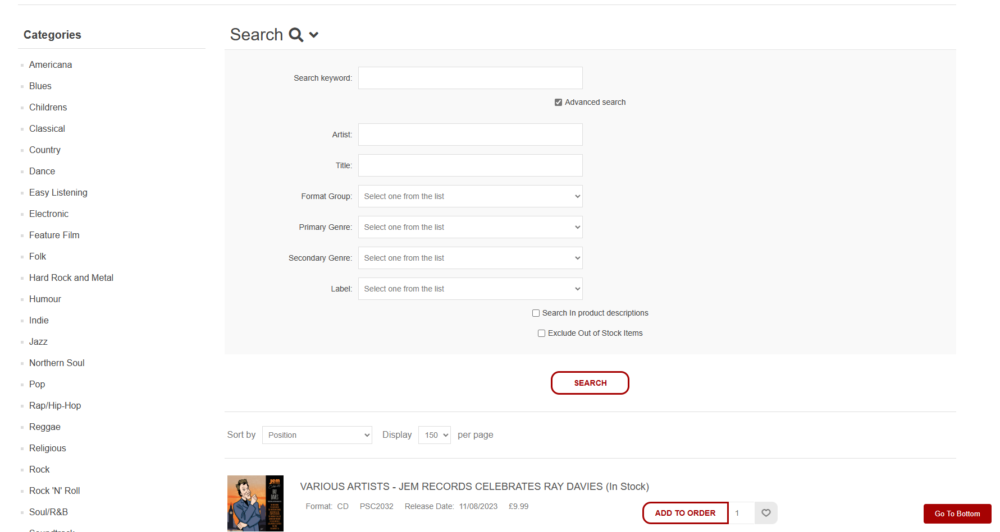
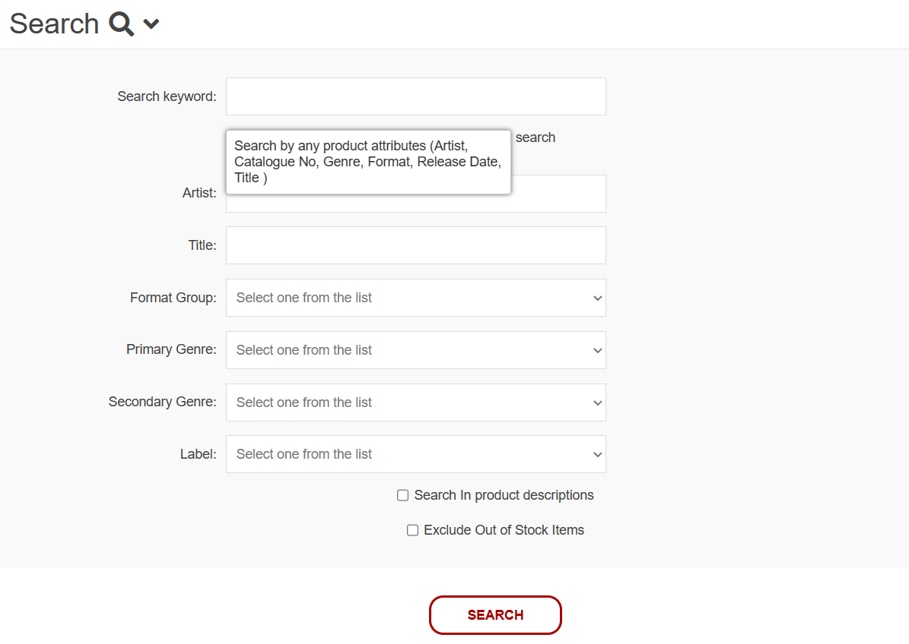

import ReactPlayer from 'react-player'
import SearchVideo from '../../static/video/vid-expanded-collapse.mp4';

Searching through B2B

## **Quick Search**
:::info
List of Product Attributes you can search through

- Artist
- Catalogue No
- Genre
- Format
- Release Date
- Title
- Description (optional)
:::

The easiest way to search for product in B2B is through the Quick Search just below the Order Import feature.
Quick Search allows you to search a keyword in relation to the product you want, and B2B will return you a list of products that contain this keyword in some fashion.

:::info
Here we can see that if we are to type a valid Cat No into Quick Search the desired product is shown as a dropdown.

:::

:::info
If your product is found it will be displayed and you can click on it to navigate you to that products details page

:::

If there are no products found in the initial search, click the search button for the Quick Search and you will be redirected to the Advanced Search.

## **Advanced Search**

The Quick Search will direct you to the Advanced Search where you can more accurately and precisely filter your products.
If you have clicked the search button on the homepage without searching a certain keyword you will be directed to a page that looks like this:

:::info

:::

The Advanced Search section

If you are navigating to the Advanced Search page with an invalid keyword entered the Advanced Search feature will be expanded, compared to searching a valid keyword where
the Advanced Search will be collapsed so you can scroll through your products easily.
:::info
Clicking on the "Search" header in Advanced Search will expand/collapse the advanced search features so you can look through the list of products more easily
<ReactPlayer playing controls url={SearchVideo} />
:::

We can see in the below image that the Advanced Search has a few options to narrow down your search. It gives the option to specifically search products Artist/Title or enter your phrase to the "Search Keyword" input and all attributes of all products will be searched for the word entered.

There are also two settings that can be applied at the bottom of Advanced Search. "Search in product descriptions" will search your keyword through all the products descriptions as well (this may take more time as you are searching more attributes) and "Exclude Out of Stock Items" which will check each products stock to exclude it from your results.

:::info

:::
