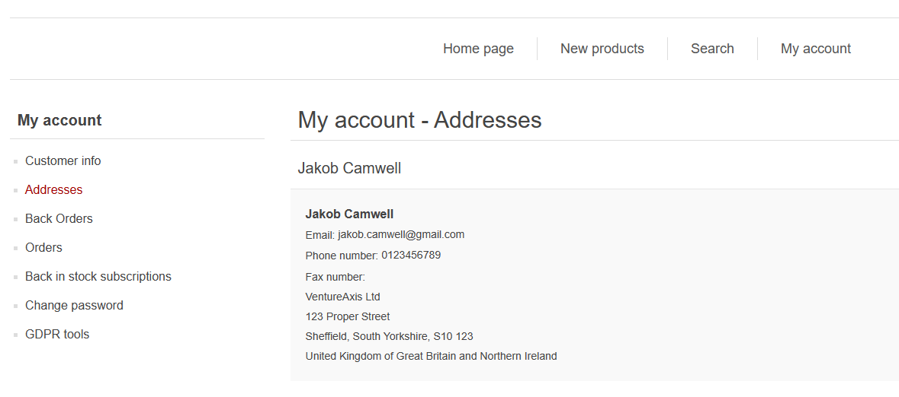

Wheres my information?

Your account information contains your personal information, your list of addresses, the list of orders and back orders for your store, changing your password and information relating to your data and GDPR.

:::info
Links to your Account information

:::

## **Your Details**

On this page you can check that we've entered your details correctly and that at the bottom of this page, in the Options section, that these fields are filled out, otherwise your B2B account will not work correctly.

:::info
What your personal information may look like

:::

## **Your Addresses**

On this page you must check these addresses are correct as when you send an order through we will be using these as a reference of where to send your items.

:::info
A list of addresses

:::

## **Your Stores Back Orders**

Through this page you can see the current list of back orders for your store, and filter by Catalogue No, Artist, Barcode, Title or Format.
You can also download the list of back orders you are viewing into an excel sheet for further use.

:::info
A list of products that are currently on back order for your store

:::

## **Your Orders**

Through this page you can see the current list of back orders for your store, and filter by Catalogue No, Artist, Barcode, Title or Format.
You can also download the list of back orders you are viewing into an excel sheet for further use.

:::info
A list of your orders to date

If we then expand one of these orders using the "Details" button for that order (highlighted in red above) we will see the orders information:

:::

In Order Information, a certain orders details will be laid out, including options to print or download an invoice of the order, re-order the current order you're browsing and also review the options/status of the order.
