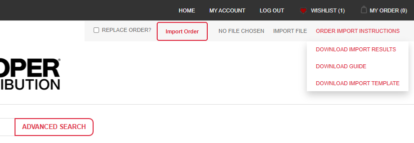
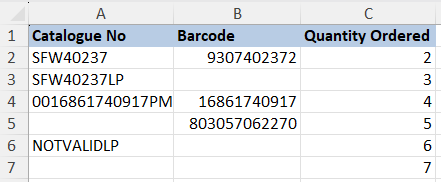
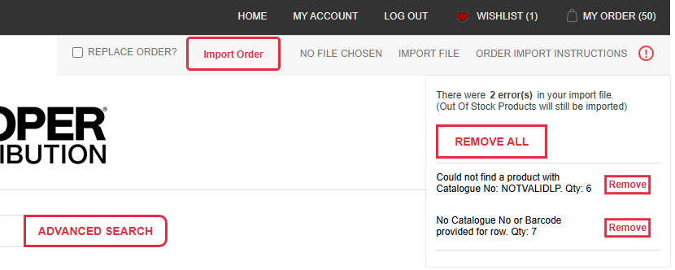
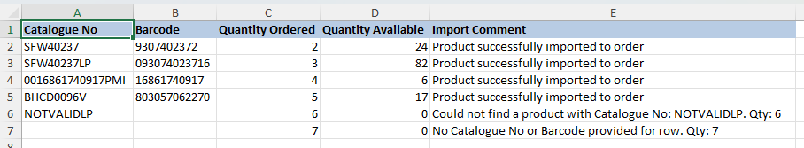
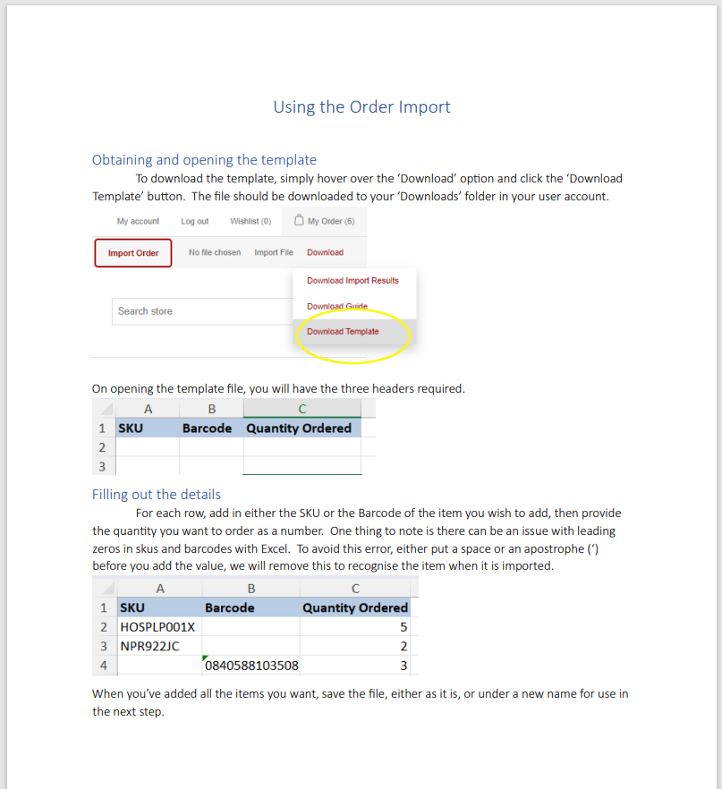

import ReactPlayer from 'react-player'
import OrderImportVideo from '../../static/video/vid-order-import-tutorial.mp4';

How to Import your Orders

The Order Import system allows you to add products to your order in large quantities from a CSV or an Excel sheet. The only basic details we need for each product is the Catalogue Number or the Barcode and the quantity you want to import.

You can also easily get the valid format and names of each column that we need to correctly import your products by downloading the template from the "Order Import Instructions" dropdown button.

:::info
Overview of the Order Import and its dropdown

Example of an excel sheet template (The last two lines would be invalid - see next image)

Hovering over the red exclamation point shows the errors in the latest import

If we then download these results from the dropdown, it will have the relevant comments for each order line

Note: you can re-import this "Downloaded Results" file without changing your column headers as we match which column is which by the column name
:::

Any errors in your import will appear if you hover over the red exclamation point next to the Download dropdown, and the valid products will be imported.

The Replace Order checkbox will empty your order before you import more products.

You can also find a detailed guide of this process in Download dropdown by clicking "Download Guide"
:::info

:::

Here is also a short video of the whole Order Import process using this excel sheet:

<ReactPlayer playing controls url={OrderImportVideo} />