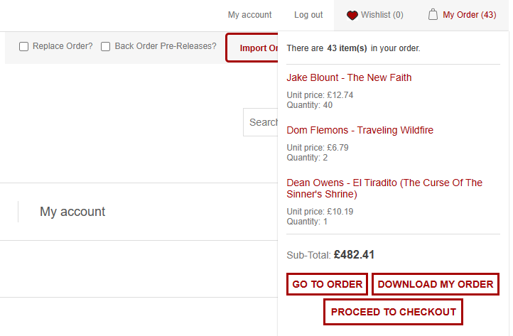
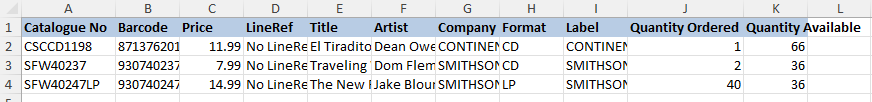
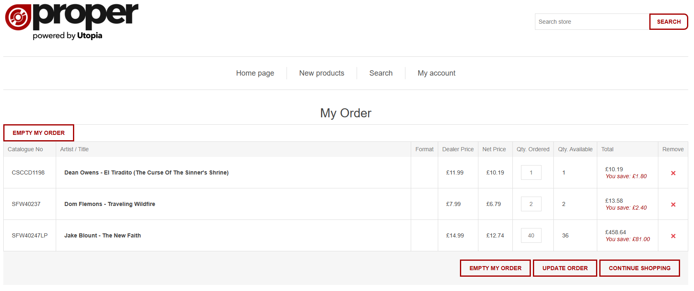
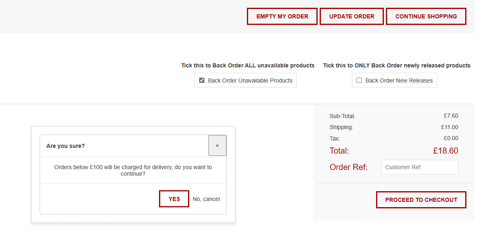

Your Order Summary

To see a quick summary of your current order you can simply hover over the My Order dropdown in the top right of the navigation bar.

:::info

:::

From this dropdown you can go to a more detailed view of your order, go straight to the checkout or download the products in your order to an excel sheet.

:::info
If click "Download My Order" you can see more relevant information about each product in your order and this file can be re-imported without modification as we map each column by name

:::

The Order Summary page shows further details, discounts and available stock quantities, as well as options to further change your order.

:::info
We can see here in the summmary, the basic details of each product we want to order, the different prices of the product, and the quantity we want to order compared to the stock quantity that is available to order.
The product total column will total up the quantity you want to order, apply any discounts and display your total price and the amount you are saving.

:::

You can remove any singular products with the Remove button on each product row, or remove everything in your Order to start again using the Empty My Order button.
If you want to change the quantity of a certain product already in your Order, you can simply amend the quantity in the products row, then click Update Order to apply the changes.

Below the Order action buttons there will be some options that will change how your order is processed once its been confirmed.
:::info

:::

The Back Order Unavailable Products option will tell our system that there are certain products in your order that you would like to be put on back order for when they are available again.

The Order Reference is a custom text field that you can add a reference for it to be displayed on the order summary.

The Back Order New Releases option will ONLY put orders on back order if they haven't been released yet - products that are out of stock will be ignored.

If you're happy with your order you can press Proceed To Checkout and you can continue completing your order. Our system will notify you if you are below the required price for free delivery.
